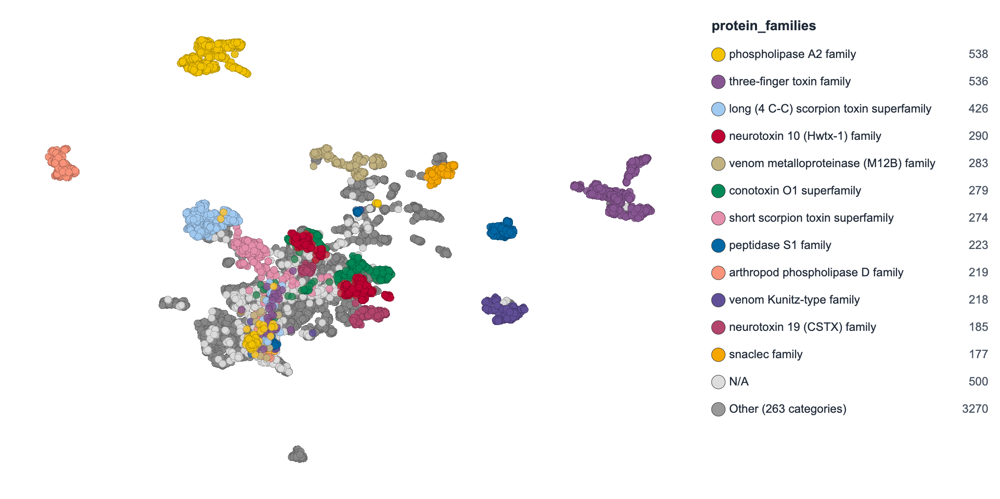

# ProtSpace

[](https://badge.fury.io/py/protspace)
[](https://www.python.org/downloads/)
[](https://www.gnu.org/licenses/gpl-3.0)
[](https://pepy.tech/project/protspace)
[](https://doi.org/10.1016/j.jmb.2025.168940)

ProtSpace is a visualization tool for exploring **protein embeddings** or **similarity matrices**. It projects high-dimensional protein language model data into 2D space, color-codes proteins by biological annotations, and exports publication-ready figures.

- **Multiple projections**: PCA, UMAP, t-SNE, MDS, PaCMAP, LocalMAP
- **Automatic annotations**: UniProt, InterPro, and Taxonomy
- **Structure viewer**: Integrated protein structure visualization
- **Export**: PNG, PDF, SVG, HTML

## 🌐 Try Online

**[ProtSpace Web](https://protspace.app/explore)**: Fast 2D explorer optimized for large datasets — drag & drop `.parquetbundle` files ([source](https://github.com/tsenoner/protspace_web))

## 🚀 Google Colab Notebooks

**Note**: Use Chrome or Firefox for best experience.

1. **Generate Protein Embeddings**: [](https://colab.research.google.com/github/tsenoner/protspace/blob/main/notebooks/ClickThrough_GenerateEmbeddings.ipynb)

2. **Prepare ProtSpace Bundle**: [](https://colab.research.google.com/github/tsenoner/protspace/blob/main/notebooks/ProtSpace_Preparation.ipynb)


## 📦 Installation

```bash
pip install protspace
```

## 🎯 Quick Start

### 1. Prepare data

```bash
# From HDF5 embeddings
protspace prepare -i embeddings.h5 -m pca2,umap2 -o output

# From HDF5 embeddings using rhoPCA
# --background is repeatable; optional :LABEL suffixes name each projection
protspace prepare -i embeddings.h5 -m rhopca2,pca2,umap2 --background background_embeddings.h5 -o output

# Run rhoPCA separately against two named backgrounds
protspace prepare -i embeddings.h5 -m rhopca2,pca2 \
  --background embeddings/non3FTx_5050_lengthmatched.h5:5050_length \
  --background embeddings/random.h5:random -o output

# From FASTA (auto-embeds via Biocentral API)
protspace prepare -i sequences.fasta -e prot_t5 -m pca2 -o output

# Multi-model comparison (12 pLMs supported)
protspace prepare -i sequences.fasta -e prot_t5,esm2_650m,ankh_base -m pca2,umap2 -o output

# Combine datasets (same embedding name → proteins are unioned)
protspace prepare -i species_a.h5:prot_t5 -i species_b.h5:prot_t5 -m umap2 -o output

# Quality evaluation via `--eval`
protspace prepare \
  -i embeddings.h5 \
  -m pca2,umap2 \
  -a default \
  --eval \
  --label categorical:protein_families \
  --filter 50 \
  -o output
```

### Supervised evaluation with multiple labels

Repeat `--label` to evaluate several annotation columns. Prefix continuous
targets explicitly; untyped labels remain categorical for backward compatibility.

```bash
protspace prepare -i embeddings.h5 -m pca2,umap2 --eval \
  --label categorical:protein_families \
  --label continuous:sequence_length -o output
```

### Robustness evaluation for stochastic reducers

Use `--robustness N` together with `--eval` to run t-SNE, UMAP, densMAP,
PaCMAP, LocalMAP, MDS, TriMAP, and PHATE `N` times with consecutive random
seeds. The requested seed is used for the first run and incremented for each
additional run. Deterministic reducers still run once, and only the first
projection is included in the output bundle.

For chained methods, the deterministic prefix is computed once and reused.
Each robustness realization starts at the first stochastic stage and reruns
the complete remaining suffix, since later stages consume seed-dependent data.

```bash
protspace prepare -i embeddings.h5 -m umap2,tsne2,pca2 --eval \
  --robustness 10 --label categorical:protein_families -o output
```

Evaluation plots show the mean with sample-standard-deviation error bars.
Summary heatmaps annotate repeated reducers as `mean ± SD`. Each embedding's
`eval/<embedding>/summary.tsv` combines all its labels, with supervised columns
qualified by label (for example, `knn_acc_mean:protein_families`). Its
comment-prefixed footer records robustness, effective k values, filtered and
evaluated sample counts, cross-validation settings, and other run metadata.

Categorical labels use kNN accuracy, silhouette score, and the
permutation-corrected CONCORDEX coefficient (100 label permutations), plus
up to five-fold stratified cross-validated linear-classifier ROC-AUC and macro F1.
Neighborhood metrics are evaluated at `k=5,10,20,30,50`. Continuous labels
use cross-validated linear-regression R² and kNN-regression R², distance
correlation, and Spearman correlation between pairwise embedding distances and
target differences. Values near zero indicate little predictive signal or
dependence. All metrics share a deterministic 10,000-protein cap.
Unsupervised outputs are written once to `eval/<embedding>/`; with multiple
labels, supervised outputs are separated into `eval/<embedding>/<label>/`.
With one label, all plots remain directly in `eval/<embedding>/`. The
`--filter` threshold applies only to categorical labels.

### 2. Explore results

Upload the generated `.parquetbundle` file at [protspace.app/explore](https://protspace.app/explore).

### 3. Power-user workflow (individual steps)

```bash
protspace embed -i sequences.fasta -e prot_t5 -e esm2_3b -o embeddings/
protspace project -i embeddings/prot_t5.h5 -i embeddings/esm2_3b.h5 -m pca2,umap2 -o projections/
protspace annotate -i embeddings/prot_t5.h5 -a default -o annotations.parquet
protspace bundle -p projections/ -a annotations.parquet -o output.parquetbundle
```

## 📊 Example Output



## ✨ Annotations

Use `-a` to color-code proteins by UniProt, InterPro, or Taxonomy annotations. Groups (`default`, `all`, `uniprot`, `interpro`, `taxonomy`) and individual names can be mixed freely. If `-a` is omitted, the `default` group is used.

```bash
protspace prepare -i data.h5 -m pca2                              # default annotations
protspace prepare -i data.h5 -a default,interpro,kingdom -m pca2  # mix groups + individual
```

## 📖 Documentation

- [Annotation Reference](docs/annotations.md) — full list of annotations, groups, data sources, output formats
- [Annotation Styling](docs/styling.md) — custom colors, shapes, sort modes, and the `--generate-template` workflow
- [CLI Reference](docs/cli.md) — command options, method parameters, file formats

## 📝 Citation

Senoner T, Olenyi T, Heinzinger M, Spannagl A, Bouras G, Rost B, Koludarov I. ProtSpace: A Tool for Visualizing Protein Space. *Journal of Molecular Biology*, 168940, 2025. [doi:10.1016/j.jmb.2025.168940](https://doi.org/10.1016/j.jmb.2025.168940)
